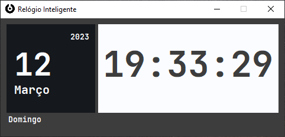

# -PYTHON-beginner-app-relogio-inteligente

O app Relógio inteligente desenvolvido em Pyhton, é um projeto nível iniciante onde estudo a lib datetime.

Ainda pretendo fazer melhorias no desing e aplicar novas funcionalidades ao app.

  

<h1> <i>App Relógio inteligente </i> versão 1.0

 

 
